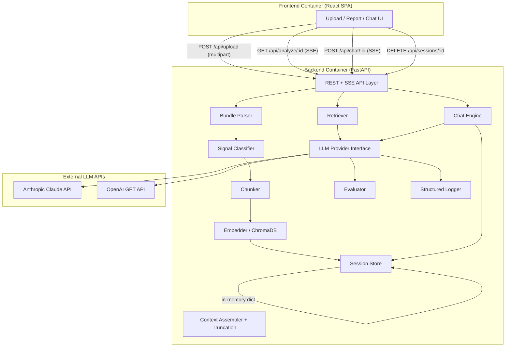

# ARCHITECTURE.md

## Overview

Unravel is a two-container web application that ingests Kubernetes Troubleshoot support bundles (.tar.gz archives), uses AI/LLM to produce structured diagnostic reports identifying issues, root causes, and remediations, and supports interactive follow-up investigation via chat with on-demand file retrieval from the bundle.

## System Diagram



## Components

### Bundle Parser (`src/backend/bundle/parser.py`)
- **Responsibility**: Accept uploaded .tar.gz file, validate format and size, extract contents in memory, produce a BundleManifest.
- **Interfaces**: `parse_bundle(file: UploadFile) -> tuple[BundleManifest, dict[str, bytes]]`
- **Dependencies**: Python `tarfile`, `io` stdlib modules.
- **Security**: Validates tar.gz magic bytes, enforces 500MB size limit, prevents path traversal during extraction. No content written to disk.

### Content Chunker (`app/bundle/chunker.py`)
- **Responsibility**: Split extracted bundle files into semantically coherent chunks for embedding. Uses content-type-aware strategies: JSON event arrays are split per-event, YAML manifests per-document, log files grouped into fixed windows, and a fixed-size fallback for everything else.
- **Interfaces**: `chunk_files(classified: dict[SignalType, list[BundleFile]], files: dict[str, bytes]) -> list[Chunk]`
- **Dependencies**: Signal classifier output, extracted file contents.
- **Config**: `RAG_CHUNK_SIZE` (default 512 tokens), `RAG_CHUNK_OVERLAP` (default 50 tokens).

### Embedder / Vector Store (`app/rag/embedder.py`)
- **Responsibility**: Embed chunks using `sentence-transformers/all-MiniLM-L6-v2` and persist them in an ephemeral ChromaDB collection scoped to the session. The collection is created on upload and discarded with the session.
- **Interfaces**: `embed_chunks(session_id: str, chunks: list[Chunk]) -> ChromaCollection`
- **Dependencies**: `chromadb` (ephemeral client), `sentence-transformers`.
- **Notes**: Embedding runs locally — no external API call. The model (~90MB) is bundled in the Docker image, which accounts for the larger image size (~700MB).

### Retriever (`app/rag/retriever.py`)
- **Responsibility**: Given a diagnostic query, perform semantic similarity search against the session's ChromaDB collection. Enforces signal-type diversity (results must cover multiple signal types where available) and a token budget cap to avoid overloading the LLM context.
- **Interfaces**: `retrieve(session_id: str, query: str, token_budget: int) -> list[Chunk]`
- **Dependencies**: Embedder (ChromaDB collection), session store.

### Quality Evaluator (`app/evals/evaluator.py`)
- **Responsibility**: Run programmatic quality checks on a completed DiagnosticReport. Checks: (1) coverage — all retrieved signal types have at least one finding referencing them; (2) citation accuracy — every `source_signals` entry in a finding maps to a real bundle file path.
- **Interfaces**: `evaluate_report(report: DiagnosticReport, context: AnalysisContext) -> EvalResult`
- **Dependencies**: DiagnosticReport, AnalysisContext.
- **Config**: `EVAL_THRESHOLD` (default 0.7) — minimum coverage score to pass. Results are logged; failures do not block report delivery.

### Signal Classifier (`src/backend/bundle/classifier.py`)
- **Responsibility**: Classify extracted bundle files into signal types based on file path patterns.
- **Interfaces**: `classify_files(manifest: BundleManifest) -> dict[SignalType, list[BundleFile]]`
- **Dependencies**: None (pure logic, regex on paths).
- **Design**: Pattern-based rules matching known Troubleshoot directory conventions. Unknown paths → `other`. No content inspection — path only.

### Context Assembler (`src/backend/analysis/context.py`)
- **Responsibility**: Assemble content into an LLM prompt. For analysis, uses semantically retrieved chunks from the Retriever rather than raw file content, then truncates to fit within the 100K token budget using a priority-based strategy.
- **Interfaces**: `assemble_context(classified: dict[SignalType, list[BundleFile]], files: dict[str, bytes], token_budget: int) -> AnalysisContext`
- **Dependencies**: Retriever output (for analysis), signal classifier output, extracted file contents.
- **Truncation priority**: events > pod_logs > cluster_info > resource_definitions > node_status. Within each type, preserve most recent content. Annotate truncated sections.

### LLM Provider Interface (`src/backend/llm/provider.py`)
- **Responsibility**: Abstract interface for LLM API calls. Two implementations: Anthropic and OpenAI.
- **Interfaces**:
  - `analyze(context: AnalysisContext) -> AsyncIterator[str]` — streaming analysis
  - `chat(messages: list[ChatMessage], tools: list[ToolDef], tool_handler: Callable) -> AsyncIterator[str]` — streaming chat with tool-use
- **Implementations**:
  - `AnthropicProvider` (`src/backend/llm/anthropic_provider.py`)
  - `OpenAIProvider` (`src/backend/llm/openai_provider.py`)
- **Selection**: Factory function reads `LLM_PROVIDER` env var at startup.

### Chat Engine (`src/backend/analysis/chat.py`)
- **Responsibility**: Manage chat conversation flow. Provide report + manifest as context. Exposes two tools to the LLM: `search_bundle` (semantic vector search via Retriever) and `get_file_contents` (full file retrieval from session store). The LLM chooses which tool fits the query.
- **Interfaces**: `handle_chat(session: Session, message: str) -> AsyncIterator[str]`
- **Dependencies**: LLM provider, session store, Retriever.

### Session Store (`src/backend/sessions/store.py`)
- **Responsibility**: In-memory storage of session objects (bundle data, manifest, report, chat history). No persistence.
- **Interfaces**: `create(manifest, files, classified) -> Session`, `get(session_id) -> Session`, `delete(session_id) -> bool`
- **Dependencies**: None.
- **GR-6 compliance**: All data in-memory only. Delete clears all references. Server restart clears all sessions.

### Structured Logger (`src/backend/logging/llm_logger.py`)
- **Responsibility**: Emit JSON log entries to stdout for every LLM API call.
- **Interfaces**: `log_llm_call(session_id, call_type, provider, model, input_tokens, output_tokens, latency_ms, status)`
- **Fields**: timestamp, session_id, call_type, provider, model, input_tokens, output_tokens, latency_ms, status.
- **GR-6 compliance**: No bundle content in log entries.

### API Layer (`src/backend/api/`)
- **Responsibility**: FastAPI routes for upload, analyze, chat, session delete. SSE streaming for analyze and chat.
- **Endpoints**: See PRD API contracts.
- **Dependencies**: All backend components.

### Frontend (`src/frontend/`)
- **Responsibility**: React SPA with three-phase UI: upload (drag-and-drop) → report display (streaming, structured findings) → chat interface (streaming, tool-use indicators).
- **Tech**: React 18, TypeScript, Vite, Tailwind CSS.
- **State**: useState/useReducer. No external state library.
- **Communication**: REST for upload/delete, SSE (EventSource) for analyze/chat.

## Data Flow

```
Upload:   parse → classify → chunk → embed (ChromaDB) → session
Analyze:  semantic retrieval → context assembly → LLM analysis → quality eval → report
Chat:     search_bundle tool (semantic via Retriever) | get_file_contents (full file from session)
```

## Tech Stack

| Layer | Technology | Rationale |
|---|---|---|
| Backend language | Python 3.12 | Best LLM ecosystem; native tar, async support |
| Backend framework | FastAPI | Async-native, SSE via StreamingResponse, lightweight |
| Frontend language | TypeScript | Type safety, aligns with Replicated stack |
| Frontend framework | React 18 + Vite | Fast dev server, SPA model fits upload→report→chat flow |
| Styling | Tailwind CSS | Utility-first, rapid prototyping, clean output |
| LLM SDKs | anthropic, openai | Official Python SDKs with streaming + tool-use |
| Embeddings | sentence-transformers (all-MiniLM-L6-v2) | Local embedding, no external API, fast on CPU |
| Vector store | ChromaDB (ephemeral) | In-process, session-scoped, zero persistence overhead |
| Backend testing | pytest + pytest-asyncio | Standard async testing for FastAPI |
| Frontend testing | Vitest + React Testing Library | Vite-native, component testing |
| Runtime | Docker Compose | Two containers, single `docker compose up` (GR-7) |

## Data Models

Defined in `src/backend/models/`. All in-memory, no database.

- **Session** — session_id, created_at, bundle_manifest, extracted_files, classified_signals, chroma_collection_id, report, chat_history
- **BundleManifest** — total_files, total_size_bytes, files[]
- **BundleFile** — path, size_bytes, signal_type
- **SignalType** — Enum: pod_logs, cluster_info, resource_definitions, events, node_status, other
- **DiagnosticReport** — executive_summary, findings[], signal_types_analyzed[], truncation_notes
- **Finding** — severity, title, description, root_cause, remediation, source_signals[]
- **Severity** — Enum: critical, warning, info
- **ChatMessage** — role, content, tool_call, timestamp
- **ToolCall** — name, arguments, result
- **AnalysisContext** — signal_contents (per-type text), truncation_notes, manifest
- **Chunk** — session_id, file_path, signal_type, text, token_count, chunk_index
- **EvalResult** — passed, coverage_score, citation_accuracy, failures[]

## Boundaries & Constraints

| Golden Requirement | Architectural Enforcement |
|---|---|
| **GR-1** (accept .tar.gz bundles) | Bundle parser validates tar.gz format; upload endpoint accepts multipart file |
| **GR-2** (must use AI/LLM) | All diagnostic output flows through LLM provider interface; no rule-only analysis paths |
| **GR-3** (actionable diagnostics) | DiagnosticReport schema requires severity, root_cause, remediation on every finding |
| **GR-4** (web application) | React SPA frontend + FastAPI backend, served via Docker Compose |
| **GR-5** (multi-signal breadth) | Signal classifier processes 5 types; context assembler includes all available types in prompt |
| **GR-6** (data sensitivity) | Session store is in-memory only; no disk writes; structured logger excludes bundle content; no external calls except LLM API |
| **GR-7** (single-command startup) | docker-compose.yml with frontend + backend containers; `.env` for config |
| **GR-8** (documented setup) | README.md with prerequisites, env config, docker compose instructions |
| **GR-9** (MY_APPROACH_AND_THOUGHTS.md) | Final task generates this file, ≤500 words |
| **GR-10** (presentable repo) | Conventional commits, clean structure, no dead code, linter enforced |
| **GR-11** (scope boundaries) | No auth, no cluster mgmt, no billing — not in task list, not in architecture |
| **GR-12** (arbitrary bundles) | Path-pattern classifier with fallback to "other"; no hardcoded bundle assumptions |
